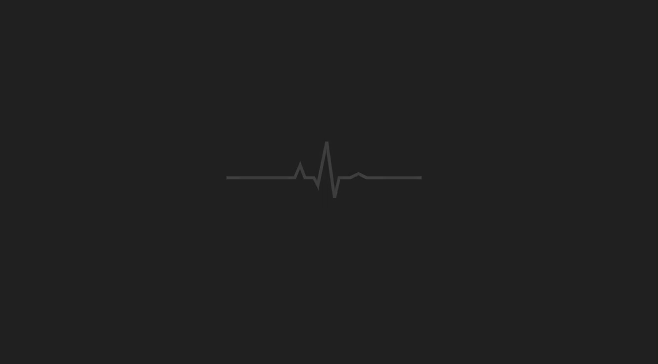
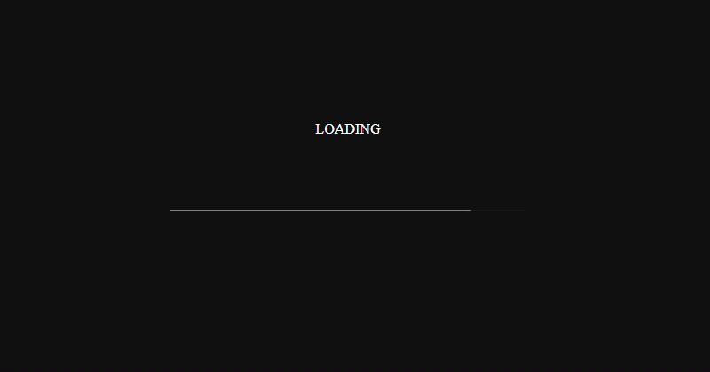

# ⏳ Web Loading Page Collection

A curated collection of modern, responsive loading / preloader screens built with **HTML**, **CSS** and **JavaScript** — easy to preview, customize and drop into any web project.

[](https://developer.mozilla.org/en-US/docs/Web/HTML) 
[](https://developer.mozilla.org/en-US/docs/Web/CSS) 
[](https://developer.mozilla.org/en-US/docs/Web/JavaScript)


## 📌 Overview

This repository contains a set of small, reusable loading screen examples (preloaders) implemented with plain **HTML**, **CSS** and optional **JavaScript**. Each loader is self-contained so it can be previewed individually and integrated into existing websites with minimal effort.

Use cases:
- Show visual feedback while a page or heavy assets load
- Improve perceived performance on single-page apps
- Use as a branded splash screen for demos and landing pages


## ✨ Features

- Multiple distinct loader designs (spinner, bar, dots, progress, custom animations)  
- Clean, dependency-free implementations (Vanilla HTML/CSS/JS)  
- Responsive and mobile-friendly by default  
- Lightweight CSS animations (performance-minded)  
- Easy to copy / customize / extend  
- Example integration code for immediate use


## 🚀 Demo  Preview

**Circle Loading**<br/>
<br/>
**Custom Background**<br/>
<br/>
**Heartbeat Animation**<br/>
<br/>
**Heartbeat Loading**<br/>
<br/>
**Preloader Animation**<br/>
<br/>


## 📂 Folder Structure

Here’s the structure of the **Web Loading Page** project:

```bash
Web-Loading-Page/
│
├── Circle Loading/
├── Custom Background/
├── Demo/
├── Heartbeat Animation/
├── Heartbeat Loading/
├── Preloader Animation/
│── LICENSE
└── README.md
```


## 🧰 Requirements

To view or modify this project, you’ll need:

- 🧭 Any modern web browser (Chrome, Firefox, Edge, Safari)
- 🖋️ A text editor (VS Code, Sublime Text, Atom)
- 🧠 Basic understanding of HTML, CSS and JavaScript


## ⚙️ Installation Guide

You can run this project locally in just a few steps:

```bash
# 1. clone this repository
git clone https://github.com/iamx-ariful-islam/web-loading-page.git

# 2. navigate to the project folder
cd web-loading-page/

# 3. open index.html in your browser
```


## 🤝 Contributing

Contributions, suggestions, and feedback are always welcome! ❤️<br/>
To contribute:

1. Fork the repository
2. Create a new branch (`feature/new-feature`)
3. Commit your changes
4. Push and submit a Pull Request

💬 You can also open an issue if you’d like to discuss a feature or report a bug.


## 🌐 For more or connect with me

<p align='center'>
  <a href="https://github.com/iamx-ariful-islam"></a>&nbsp;&nbsp;
  <a href="https://bd.linkedin.com/in/iamx-ariful-islam"></a>&nbsp;&nbsp;
  <a href="https://x.com/mx_ariful_islam"></a>&nbsp;&nbsp;
  <a href="https://www.facebook.com/iamx.ariful.islam/"></a>
</p>


## 📜 License

The [MIT](https://choosealicense.com/licenses/mit/) License (MIT)


## 💖 Thank You for Visiting!

> “Good design is about making things simple yet significant”  
> — *Md. Ariful Islam*